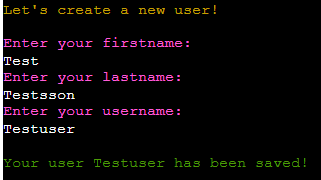
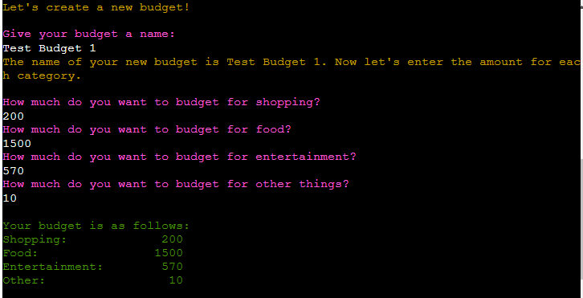
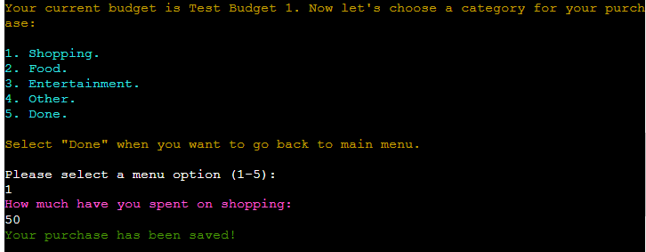
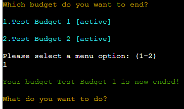
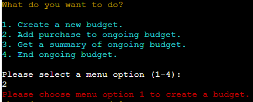
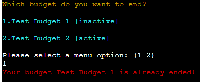

# Budget System
## Introduction
Budget system is an aid for financially conscious private individuals who wants to be able to set a budget and then follow how much they spend on shopping, food, entertainment, and other things. In this program the user can create one or several budgets, add a purchase to chosen budget, get a summary of chosen budget and end chosen budget. 
## Table of contents
- [UX/Design](#ux/design)
    - [Text colour](#text-colour)
    - [Emojis](#emojis)
- [Requirements](#requirements)
    - [User stories](#user-stories)
- [Flowchart](#flowchart)
- [Features](#features)
    -[Select user](#select-user)
    - [Create user](#create-user)
    - [Create budget](#create-budget)
    - [Budget entry](#budget-entry)
    - [Budget summary](#budget-summary)
    - [End budget](#end-budget)
    - [Common features](#common-features)
    - [Error handling](#error-handling)
- [Data](#data)
    - [Structure](#structure)
- [Test and validation](#test-and-validation)
- [Bugs corrections and improvements](#bugs-corrections-and-improvements)
    - [Unfixed bugs](#unfixed-bugs)
    - [Solved bugs](#solved-bugs)
    - [Future improvements](#future-improvements)
- [Deployment](#deployment)
    - [Heroku Deployment](#heroku-deployment)
- [Credits](#credits)

## UX/Design 
### Text colour
This system contains five different colours. The colours contribute to make it more obvious for the user because they are following a certain pattern.  
- Welcome message and text that confirms user choice for example created budget or ended budget have the colour of green. 
- All menu options have the colour of blue. 
- When the user is asked to choose a menu option the text have the colour of white.
- If the user is asked to write in something else than a menu option the text have the colour of pink. 
- All text that confirms for example active user and ask the user what they want to do next have the colour of yellow.
- All error messages have the colour of red.

### Emojis
-	To make the system feel fun and more alive it contains these three emojis: 💰💶🙂
## Requirements 
### User stories
- As a user, I want to be able to create a user account so that I can use the budget system.
- As a user, I want to see the budgets connected to my user account so that I can chose budget. 
- As a user, I want to create a new budget so I can track my budget goal.
- As a user, I want to have multiple budgets so that I can have different budgets goals.
- As a user, I want to add purchase to my budget so that my purchase is saved.
- As a user, I want to purchase to different budgets so that my purchase is saved in chosen budget.
- As a user, I want to get a summary of my budget progress whenever I want so that I can follow my spendings.
- As a user, I want to end chosen budget whenever I want so that the budget is not active because I am done.
## Flowchart

## Features
### Select user
-	The first step in the system is that the user needs to confirm if they are a recurring user or a new user. This step is crucial for the usage of the system. By doing this the user only gets the data related to the specific user.

### Create user
-	In this menu option the user will be able to create a new user by adding their information: first name, last name and username. A confirmation is shown if the user has been created. 

### Create budget
-	In this menu option the user will be able to create a budget by choosing a budget name and add spendings for each category. The user will be given a confirmation of chosen budget name and be presented with a summary of chosen budget spendings.

### Budget entry
-	In this menu option the user will be able to choose and add a purchase to chosen budget. After added purchase the user will be presented with a text that confirms that the purchase has been added. 

### Budget summary
-	In this menu option the user will be able to choose a budget to get a summary of. So that they can see how much they have spent so far and how much that is left to spend.  The user will get a confirmation, in this case which budget they have chosen to get a summary of. 

### End budget
-	In this menu option the user will be able to end an ongoing budget (change it from active to inactive). This is to make it more clear for the user which budget that no longer is ongoing.  
-	The user can’t add a purchase to an ended budget, but they still can get a summary of the budget. This is because they may want to go back and compare one budget with another.

### Common features
-	Depending on how many budgets the user has, the menu when the user choose budget is flexible and all budgets will be given a menu number. This applies to all occasions where the user will be presented with their personal budgets.  This way of selecting budgets was chosen to give the user a consistent way of navigating the system, because all menu selections are done by numbers.
 
-	When the user is asked to choose a menu option the system always show the user which options they can choose between. This is to prevent the user writing wrong input and making the system easy to use. 
### Error handling
-	This system will give the user different error messages depending on what went wrong. This is to try to lead the user in the right direction so the next input will be correct.  
-	Menu options. If the user writes a letter, other character, a number the menu doesn’t contain, only whitespaces, or nothing at all. The user will be displayed a message. 

-	The user will have the same error messages as above except the message for menu options when entering budget spendings or purchases in their budget. The message for when entering letters has also been more adapted. 

-	In contrast to menu option, when entering first name and last name the user will get an error message if entering numbers, other characters, only whitespaces, or nothing at all. The user will be displayed with a message that tells the user that the name only can contain letters. 

Username and budget name allows both numbers and letters but don’t allow only whitespaces or nothing at all.  The user will be displayed with a message that tells the user that the username/budget name can’t not be empty or only contain spaces.

-	If the user chooses a username that already exists, the user will be asked to choose another one.

-	If the user tries to add a purchase but don’t have any ongoing budget (active) they will be presented with an error message.

-	If the user tries to end a budget that is already ended, they will be presented with an error message.

## Data
All information about the user and the budgets is stored in a Google Sheet document. 
### Structure
-	The Google Sheet document contains the three worksheets: budgets, budgets entries and users. Each worksheet contains different columns but there is one column that you can find in all three sheets and that is the user id (in the user file it’s called only id). The user id is the key that connects the worksheets, so the user can be paired to right budget and entry.

-	The worksheets for budgets and budget entries have another category in comment and that is budget id. The budget id connects the worksheets, so the entry can be paired to right budget. 

-	Budget entries worksheet also has a column for id, this is not used to connect any row to any other worksheet. 

## Test and validation

Read more about test and validation [here](/TEST.md)

## Bugs corrections and improvements 
### Unfixed bugs
-	There are no known bugs. 
### Solved bugs
-	System crash when user creates a new user then goes directly to option “Create a new budget”. When user data came from input the data type of active_user was different compared to when data was read from worksheet. Solved by changing data type of active_user. 
-	System crash when user choose option “Done” before adding a purchase. Solved by add if-statement that checks if variable add_more is true, so saving to worksheet is only done when add_more is true (only false when selecting “Done”)
-	User can choose option two to four without having created a budget (has no budget). If there isn’t a budget the user shouldn’t be able to use those options. Solved by adding function check_if_user_has_budget which check if user has any budgets.
-	User can create a username that already exists. Solved by adding loop around username input. If list contains chosen username user will get error message and be asked to choose another username. 
-	System crash when choosing a menu option in budget entries that doesn’t exist (and isn't zero). As a result of the crash the system saves a purchase to the sheet that hasn’t been added by the user. Solved by declaring variables "budget_category" and "budget_entry" and adding budget_category to if statement.
### Future improvements

System:
-	Add password to ensure that no one else can see their budgets.
-	Give the user the option to compare different budgets.
-	Give the user the option to choose if they want to see all budgets or only active budgets.
-	Present the user with more information in the budget summary for example how much in percentage that is spent.

Code:
- Add type hinting
- Put python files in a folder
- Make some part of the code shorter

## Deployment
This project is deployed to Heroku. Below the steps taken to deploy is described. 

### Heroku Deployment
1.	Create an Heroku account
2.	Create a new app by choosing option “Create new app”, located at the centre of dashboard (or if you’re not a new user it’s found when expanding “New” in the top right corner).
3.	Give your app a name, choose a region and click “Create”. 
4.	Go to “Settings” in the navbar and scroll down to section Config Vars and click “Reveal Config Vars”.
-	Add key: CREDS and paste the content from your creds.json into VALUE, click “Add”.
-	Add key: PORT with VALUE 8000, click “Add”. 
5.	Scroll to section Buildpacks, click “Add Bulidpack” select python and click “Save changes”.
6.	Click “Add Bulidpack” again and select nodejs and click “Save changes”.
7.	Go to “Deploy” in the navbar and select “GitHub” in section Deployment method. Click “Connect to GitHub” in section below. 
8.	In section Connect to Github search for your repository, then click “Connect” next to your repository name. 
9.	Scroll down to section Manual deploy, select your branch and click “Deploy Branch”. After a moment your branch is deployed and a button to go to your deployed app is shown. 

[Here]( https://project3-budget.herokuapp.com/) you can find the deployed app. 

## Credits
A special thanks to my mentor Reuben Ferrante for great ideas and support.

[Article](https://towardsdatascience.com/4-tips-to-master-python-f-strings-a70ca896faa4): This article was used as a guide to change alignment of f-strings. 

[Codegrepper](https://www.codegrepper.com/code-examples/python/import+emoji+in+python)  and [Unicode](https://unicode.org/emoji/charts/full-emoji-list.html): Used as a guide when adding emojis. 

[Geeksforgeeks]( https://www.geeksforgeeks.org/python-program-to-check-if-string-is-empty-or-not/) and [Stackoverflow]( https://stackoverflow.com/questions/2405292/check-if-string-contains-only-whitespace): Used as inspiration when checking if string is empty or only contains whitespaces. 

[Miro](https://miro.com): Used for making flowchart.

[Python Standard Library](https://docs.python.org/2/library/stdtypes.html): Used for finding built-in types. 

[Stackoverflow]( https://stackoverflow.com/questions/14790980/how-can-i-check-if-key-exists-in-list-of-dicts-in-python): Was used as inspiration when checking if entered username is a user. 

[Stackoverflow]( https://stackoverflow.com/questions/287871/how-to-print-colored-text-to-the-terminal): Was used as inspiration when adding colours to consol text.

[TutorialKart](https://www.tutorialkart.com/python/python-range/python-if-in-range/): Used as a guide when building if statement.

